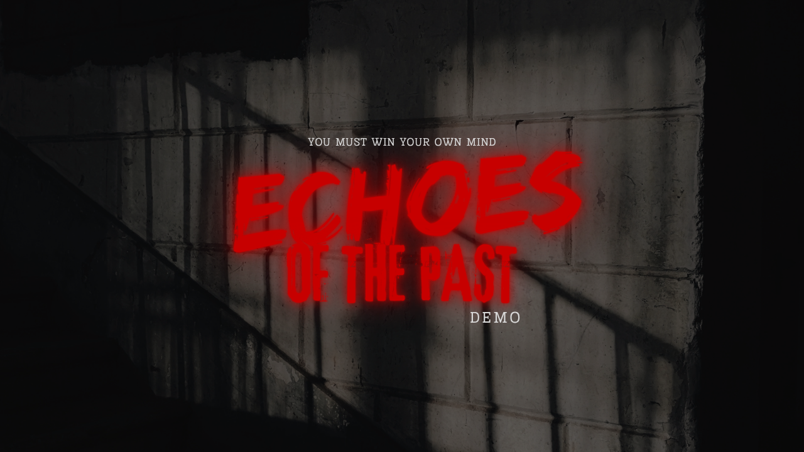
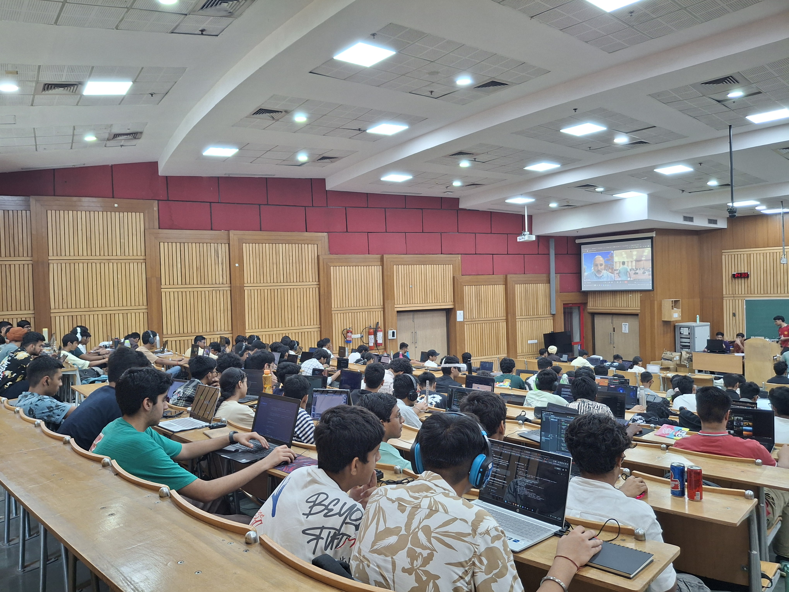
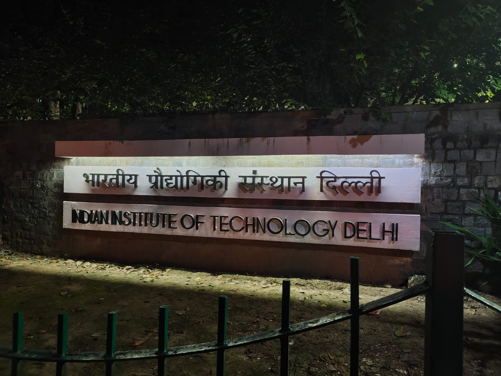
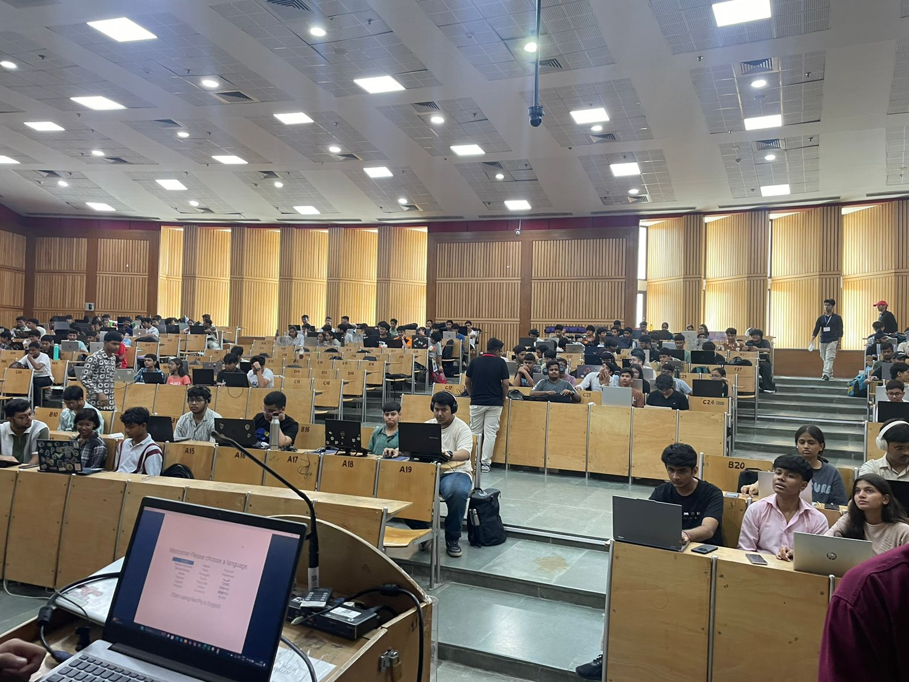

# The Golden Downfall

!!! trophy "TLDR;"
    What I was: **Why I don't get result for the hard work I do ? Why always something bad happens with me ?**

    What I became: **Results are not always materialistic. Sometimes a lesson is the fruit of hardwork**

I participated in Hack Club's Juice and made a game inspired from Resident Evil 7 & Cry Of Fear.

Can't thank Thomas enough, even though I was not able to attend the event, it just changed me who I am completely. Basically, I qualified for the event, I had 400 USD in stipends to cover my flight.

I applied for passport and guess what HARASSMENT. To be very clear I am not afraid to say that Police took 6K+2K INR in bribe to get my verification cleared without delay. Yes, they were intentionally delaying it for money. They harassed my father till core. The ACP of the district are all di*kheads. I say it very clearly.

I went to Home Ministry of India for help, I explained them, I begged for help and he said "Going to different country is not a game there are rules" I just simply said **WHAT RULES HUH ? THE RULE TO HARASS THE MIDDLE CLAS ? YOU OFFICERS TOOK BRIBE FROM ME TO PASS MY VERIFICATION, AND YOU TALKING ABOUT RULES** they misbehaved and said **TAKE YOUR FILES AND GO AWAY BEFORE I KICK YOU OUT**

This was just unbelievable and I was furious. And since that day I hate the government. But you know, it wouldn't change anything, so I started to look for how to organise my own hackathons and after a few months I was selected as **PoC Of Daydream Delhi** and knew what my goal `Open and Accessible Hackathon In India`.

Me and my team tried our best and got `IIT Delhi` India's best engineering institute as venue, `Scaler School Of Tech` as sponsor (1K USD) along with StacksKB, India's best keyboard manufacturer.

There is a lot I can talk about Daydream Delhi but after everything I learned that **It's not about how you do the work, but how you manage people**

.jpg)

Participants of Daydream Delhi are now running their own local initiatives inspired by Daydream and I am invited as mentor and judge to one of the local competitions along with Joint Comissioner of the District so it was win for me.

We had participants who could not even afford travel and food. And they still attended and learned with Hack Club's and our sponsor's support.

There were a lot of times, when I got into dilemmas and yes I took the right decisions.There exist people who can't hear a no or just think everybody except them is fool.

And thanks to Daydream team specially Renran and Deven for being empathetic with me.

I am now looking to organise more events because I know it will be different this time

PS: The ACP to whom I handed 2K INR as bribe, came to my school as a chief guest in school assembly to lecture about honesty and hardwork. Can you believe this ?

