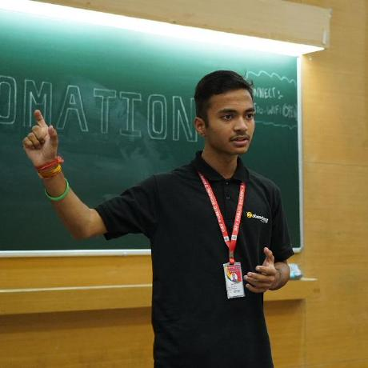
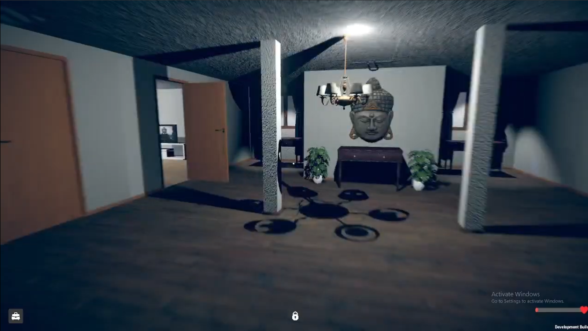
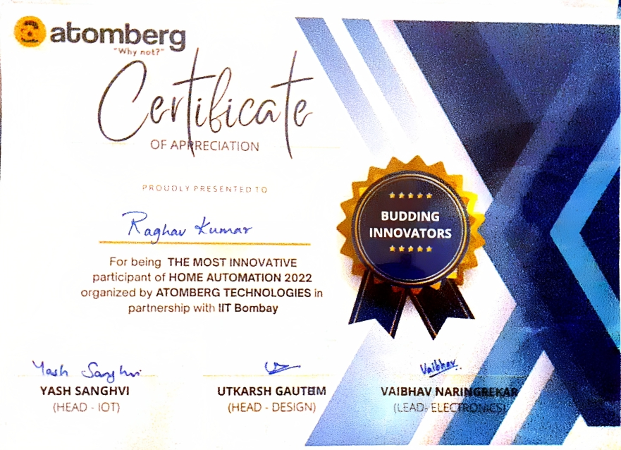

# The New Life

!!! trophy "TLDR;"
    What I was: **An arrogant popular kid with good amount and quality of technical skills.**

    What I became (2023): **I am not the main character, I am just another living being with some good skills.**  

I had good technical skills as compared to my peers. So, I was kind of famous during my school life. But back then when I was in class 9, I was something different a hot-headed guy with an attitude that he is the only best person in the room.

So, 9th standard started and I was given a team to lead for AI School Exhibition project. We worked and completed the project. The problem was my team didn't knew much of the technical details of the project.

Now comes the exhibition day. I was out for another inter-school compeition. And boom it failed in front of the guests my team was embarassed.

Next day, I was scolded of my attitude. And I was like **Who are they to point fingers at my project, it's just that Blynk's new system is sh*t and they can't handle it**

As a result I spent a few weeks designing and building an automation platform easy enough to be used by a layman.

**SIMPLE & FLEXIBLE**

Project worked superb Atomberg Inc loved it and me and my friend were invited to IIT Bombay's Techfest 2022 Asia's biggest technical fest. And guess what we won Youngest National Finalists & Budding Innovators award.
And we were the youngest participants ever.

This is from where my fav PFP came from.

After that, came 2023 10th standard. I thought like **oh let's do this, I am sure I will win this**, with this attitude I aimed for Samsung Solve For Tomorrow and dreamt of winning it. But guess what **I didn't even pass 1st round**

It took me a week but I understood, life is not something I can get much control of. It's just that I have to go with the flow. Not life which has to go with my flow.

And I met really great people like Khuzeyhan Ozdemir, from George Mason University now Director at NobleReach Foundation.
